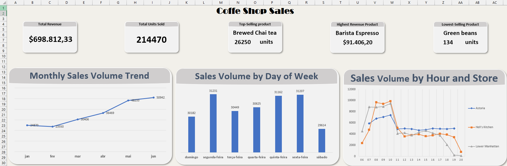
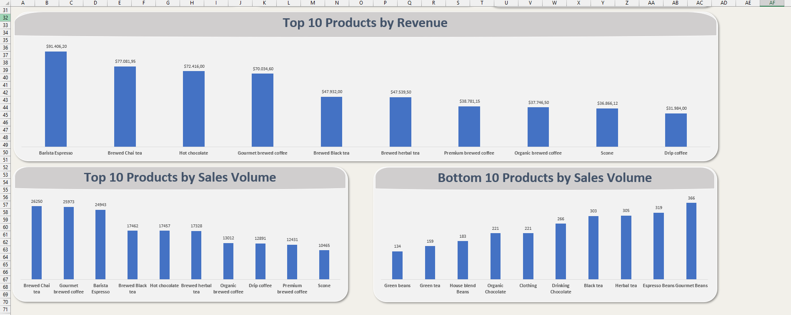

# ☕ Coffee Shop Sales Analysis — Excel

Este projeto apresenta uma análise de dados de vendas de uma cafeteria, utilizando Excel para explorar o comportamento das vendas, identificar tendências, analisar produtos e comparar o desempenho entre diferentes lojas.

---

## 📜 Tabela de Conteúdos

- [📘 Contexto](#-contexto)
- [🎯 Objetivo](#-objetivo)
- [❓ Perguntas de Negócio](#-perguntas-de-negócio)
- [🔎 Análises Realizadas](#-análises-realizadas)
- [💡 Respostas às Perguntas](#-respostas-às-perguntas)
- [📊 Principais Insights](#-principais-insights)
- [📈 Dashboard](#-dashboard)
- [🛠 Tecnologias Utilizadas](#-tecnologias-utilizadas)
- [📂 Estrutura do Projeto](#-estrutura-do-projeto)
- [📥 Arquivo do Projeto](#-arquivo-do-projeto)
- [🧑‍💻 Autor](#-autor)

---

## 📘 Contexto

O projeto utiliza um conjunto de dados de vendas de uma cafeteria fictícia, contendo informações sobre transações, datas, horários, lojas, produtos, categorias e preços.

A análise foi desenvolvida com o objetivo de transformar os dados transacionais em informações que auxiliem na compreensão do comportamento das vendas.

---

## 🎯 Objetivo

O objetivo principal é analisar o desempenho das vendas e identificar padrões relacionados ao comportamento dos clientes, desempenho dos produtos e distribuição das vendas ao longo do tempo.

---

## ❓ Perguntas de Negócio

O projeto busca responder às seguintes perguntas:

1. Como as vendas da cafeteria evoluíram ao longo do tempo?
2. Quais dias da semana apresentam maior volume de vendas?
3. Quais horários são mais movimentados e esse comportamento se mantém nas diferentes lojas?
4. Quais produtos são vendidos com maior e menor frequência?
5. Quais produtos geram maior receita?

---

## 🔎 Análises Realizadas

### 📅 Vendas ao longo do tempo

Foi analisado o volume de vendas mensal entre janeiro e junho.

### 📆 Vendas por dia da semana

Foi analisado o volume de unidades vendidas em cada dia da semana para identificar os dias de maior e menor movimento.

### 🕐 Vendas por horário e loja

Foi analisado o volume de vendas por hora, comparando o comportamento das três lojas.

### 🛍️ Análise de produtos

Foram identificados os produtos com maior e menor volume de vendas.

Também foi analisada a receita gerada por cada tipo de produto.

---

## 💡 Respostas às Perguntas

### 1. Como as vendas da cafeteria evoluíram ao longo do tempo?

O volume de vendas apresentou uma tendência geral de crescimento entre janeiro e junho, apesar de uma redução em fevereiro.

- Janeiro: **24.870 unidades**
- Fevereiro: **23.550 unidades**
- Junho: **50.942 unidades**

Junho apresentou o maior volume de vendas do período analisado.

### 2. Quais dias da semana apresentam maior volume de vendas?

A **segunda-feira** apresentou o maior volume de vendas, com **31.231 unidades**.

O **sábado** apresentou o menor volume, com **29.614 unidades**.

A diferença relativamente pequena entre os dias indica que as vendas estão distribuídas de forma bastante equilibrada ao longo da semana.

### 3. Quais horários são mais movimentados?

O período da manhã apresentou os maiores volumes de vendas, com destaque para **10h**, que registrou **26.713 unidades vendidas** no total.

Esse comportamento de maior movimentação no período da manhã também foi observado nas três lojas analisadas.

### 4. Quais produtos são vendidos com maior e menor frequência?

O produto mais vendido foi **Brewed Chai Tea**, com **26.250 unidades**.

O produto menos vendido foi **Green Beans**, com **134 unidades**.

### 5. Quais produtos geram maior receita?

O produto que gerou a maior receita foi **Barista Espresso**, totalizando **$91,406.20**.

Um ponto relevante identificado foi que o produto mais vendido em quantidade não foi o produto que gerou a maior receita.

---

## 📊 Principais Insights

- Junho apresentou o maior volume mensal de vendas, com **50.942 unidades**.
- Fevereiro apresentou o menor volume, com **23.550 unidades**.
- Segunda-feira apresentou o maior volume entre os dias da semana, com **31.231 unidades**.
- Sábado apresentou o menor volume, com **29.614 unidades**.
- **10h** apresentou o maior volume geral de vendas.
- **Brewed Chai Tea** foi o produto mais vendido, com **26.250 unidades**.
- **Green Beans** apresentou o menor volume de vendas, com **134 unidades**.
- **Barista Espresso** foi o produto de maior receita, com **$91,406.20**.
- O produto de maior volume de vendas não foi o produto de maior receita.

---

## 📈 Dashboard

O projeto conta com um dashboard desenvolvido no Excel para apresentar os principais indicadores e resultados da análise de forma visual.

### Indicadores apresentados

- Receita total
- Total de unidades vendidas
- Produto mais vendido
- Produto de maior receita
- Produto menos vendido

### Visualizações

- Tendência mensal das vendas
- Volume de vendas por dia da semana
- Volume de vendas por horário e loja
- Top 10 produtos por receita
- Top 10 produtos por volume de vendas
- Bottom 10 produtos por volume de vendas

---

## 🛠 Tecnologias Utilizadas

- Microsoft Excel
- Tabelas Dinâmicas
- Gráficos
- Fórmulas do Excel
- Análise e visualização de dados

---

## 📂 Estrutura do Projeto

- `Coffee_Shop_Sales_Analysis.xlsx` → arquivo principal contendo os dados, análises e dashboard
- `01_Original_Dataset.png` → visualização da base original
- `02_Data_Preparation.png` → preparação e criação de campos auxiliares
- `03_Pivot_Analysis.png` → tabelas dinâmicas utilizadas nas análises
- `04_Dashboard.png` → dashboard final

---

## 📥 Arquivo do Projeto

O arquivo Excel completo utilizado na análise está disponível neste repositório:

[📊 Coffee Shop Sales Analysis - Excel](./Coffee_Shop_Sales_Analysis.xlsx)

---

## 🧑‍💻 Autor

**Luis Fernando Sosnoski de Souza**

Formado em Engenharia da Computação — 2025

Foco em Análise de Dados
